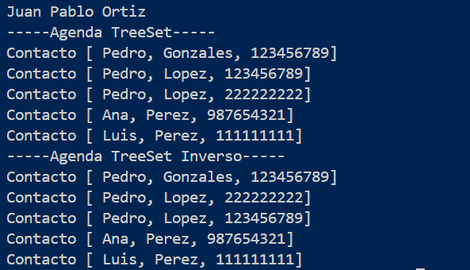

# Práctica de Sets en Java

## 📌 Información General

- **Título:** Práctica de Sets en Java
- **Asignatura:** Estructura de Datos
- **Carrera:** Computación
- **Estudiante:** Juan Ortiz
- **Fecha:** 19/6/2025
- **Profesor:** Ing. Pablo Torres

---

## 🛠️ Descripción

Este proyecto implementa y compara diferentes tipos de Sets en Java:
- `HashSet`
- `LinkedHashSet`
- `TreeSet`
- `TreeSet` con comparador personalizado
- `TreeSet` con comparador inverso

Permite observar el comportamiento de cada implementación respecto al almacenamiento y ordenamiento de elementos.

---

## 🚀 Ejecución

Para ejecutar el proyecto:

1. Compila el código:
    ```bash
    javac -d bin src/App.java src/controllers/Sets.java
    ```
2. Ejecuta la aplicación:
    ```bash
    java -cp bin App
    ```

---

## 🧑‍💻 Ejemplo de Salida

```plaintext
-----HashSet-----
Elemnentos del HashSet
[Celular, Laptop, Manzana, Pera]
-----LinkedHashSet-----
Elemnentos del LinkedHashSet
[Laptop, Manzana, Pera, Celular]
-----TreeSet-----
Elemnentos del TreeSet
[Celular, Laptop, Manzana, Pera]
-----TreeSet Comparado-----
Elemnentos del TreeSetConComparador
[Pera, Laptop, Celular, Manzana, Celulas]
-----TreeSet Comparado Inverso-----
Elemnentos del TreeSetConComparador
[Manzana, Celulas, Celular, Laptop, Pera]
```

---

## Imagen de consola


## Imagen de consola

